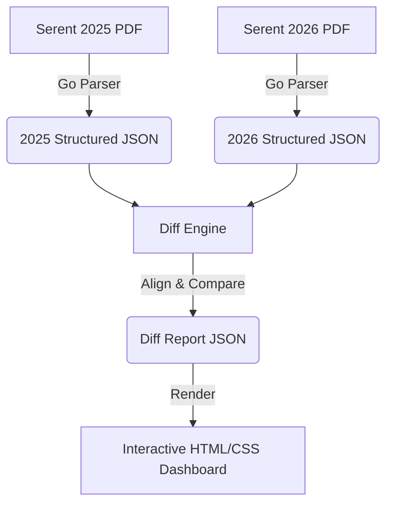

# Cybersecurity Assessment Diff Tool - Implementation Plan

This document outlines the design and implementation roadmap for the Cybersecurity Assessment Diff Tool. The tool will parse yearly cybersecurity assessment reports (PDFs), compare scores, detect changes in responses/questions, and present the differences in a sleek, interactive dashboard.

---

## 1. Architectural Overview



The system will consist of three main components:
1. **Data Extraction Pipeline (Go)**: A parser using `github.com/dslipak/pdf` to extract structured categories, scores, questions, selected options, evidence attachments, and comments.
2. **Diffing Engine (Go/JS)**: Logic to match questions year-over-year (accounting for shifted indices), calculate delta scores, and highlight checkmark additions/deletions.
3. **Web-Based Dashboard UI (HTML/CSS/JS)**: A premium, dark-mode single-page application for reviewing the differences interactively.

---

## 2. Discovery Findings: 2025 vs. 2026

Our discovery phase revealed critical changes between the two reports:

### Score Comparison
* **Overall Score**: Dropped from **83** (2025) to **63** (2026) — a **-20 point delta**.
* **Category Breakdown**:
  | Category | 2025 Score | 2026 Score | Delta |
  | :--- | :---: | :---: | :---: |
  | **Recurring Hygiene** | 55 | 39 | **-16** |
  | **Organization and Planning** | 64 | 72 | **+8** |
  | **Technical and Tooling** | 100 | 64 | **-36** |
  | **Secure Process** | 76 | 73 | **-3** |

### Key Posture Changes (Technical and Tooling)
* **Network Device Hardening (Q45)**: Severe regression. Dropped from a high-proficiency control set (SSH/HTTPS only, MFA enforced, default accounts disabled) to "informal or not in place" (Score: 1.0).
* **BYOD Management (Q40)**: In 2025, personal devices were permitted and centrally managed. In 2026, personal devices are "not permitted", but they no longer utilize any device management tools (resulting in unchecked security controls).
* **Remote Access (Q48)**: In 2025, VPN access with MFA was in place. In 2026, remote access is "not permitted" and marked N/A.
* **Privileged Account Management (Q46)**: Regressed. In 2026, admin accounts are now shared and administrators use service accounts for actions.

### New Questions Added in 2026
Two new questions were introduced in 2026, causing a shift in question numbering:
1. **Q57: AI/LLM Visibility** (Technical and Tooling) — Score: 3.6
2. **Q63: Secure agentic engineering review** (Secure Process) — Score: 3.6

---

## 3. UI/UX Design Specification

We will build a high-fidelity, interactive, dark-mode dashboard.

### Key UI Features
* **Overall Score Hero widget**: A beautiful circular gauge highlighting the 20-point drop with gradient visual cues.
* **Category Performance Cards**: Grid cards showing category scores and growth deltas. Clicking a card dynamically filters the question lists.
* **Smart Alignment Tree**: Detailed view aligning questions side-by-side. 
  - **Visual Badges**: A bright `[NEW]` badge next to Q57 and Q63.
  - **Checkmark Diffing**: Choices are highlighted:
    - <span style="color:#10B981">Green (+)</span> for items checked in 2026 but not in 2025 (improvement).
    - <span style="color:#EF4444">Red (-)</span> for items checked in 2025 but unchecked in 2026 (regression).
    - Gray for unchanged items.
  - **Comments & Attachments section**: Clickable dropdowns displaying respondent justifications and evidence file lists.

---

## 4. Implementation Steps

### Phase 1: Parse and Structure (Backend)
1. **Build the Go Parser**:
   - Write a regex-based parser that scans the layout text of both PDFs.
   - Extract the following fields per question:
     ```json
     {
       "id": "Q33",
       "text": "Which of the following are in place relating to the assignment of responsibilities for security?",
       "score": 4.4,
       "options": [
         { "text": "Responsibilities have not been assigned...", "checked": false },
         { "text": "Named individual(s) are in place...", "checked": true }
       ],
       "evidence": ["Analyst.png", "roles and responsibilities.png"],
       "comments": "All roles and responsibilities of IR team members are..."
     }
     ```
2. **Generate Standardized JSON Outputs**:
   - Save parsed files as `2025_assessment.json` and `2026_assessment.json`.

### Phase 2: Diff Engine Development
1. **Map Questions Robustly**:
   - Implement text-similarity matching (e.g., Jaccard Similarity) so that questions that shifted numbers (e.g., Q58 in 2025 becoming Q59 in 2026) are matched correctly.
   - Flag questions that do not find a match in 2025 as `isNew: true`.
2. **Run Diff Analysis**:
   - Output a single consolidated `diff_report.json` containing aligned questions with score deltas and itemized checkbox status (added/removed/unchanged).

### Phase 3: Dashboard Interface (Frontend)
1. **Base Framework**: Create a clean, single-page application structure.
2. **Styling (CSS)**: Implement a professional dark-mode design system with:
   - Primary: Slate Blue / Electric Violet gradients.
   - Success/Warning/Danger indicators.
   - Glassmorphic panels with backdrop filters.
3. **Interactive JavaScript**:
   - Load the `diff_report.json` dynamically.
   - Bind click event handlers to category cards to filter the tree details.
   - Render checkmark lists with colored delta indicators.

---

## 5. Verification & Testing

* **Parsing Accuracy**: Cross-check the generated JSON files against the original PDFs to ensure no checkbox status or score was skipped.
* **Diff Alignment Test**: Verify that the new questions (AI/LLM Visibility and Secure agentic engineering review) are flagged as `[NEW]` and do not misalign the adjacent questions.
* **Responsive Layout Check**: Validate the dashboard layout across multiple screen sizes to ensure a premium desktop and tablet viewing experience.
